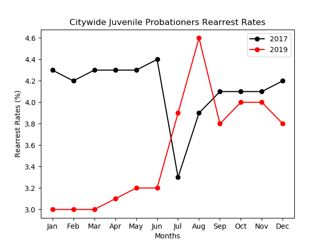
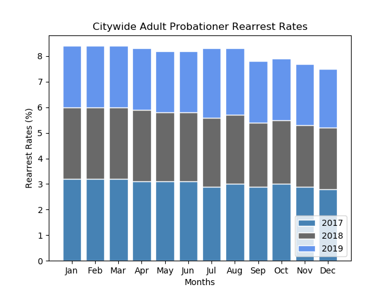

# rearrest-visualization

This project aims at viewing and comparing rearrest rates in NYC among juveniles and adults. The programs I wrote create two different types of data visualizations. The program that creates a graph to compare juvenile rearrest rates includes a user input element. The data set that the grpah uses
has incomplete data for the years 2016 and 2020 so I made a program that allows the user to
compare any two years between 2017 and 2019. The rearrest rate is described on the NYC
Open Data site as, “ The number of juvenile probationers rearrested divided by the number
supervised during the reporting period.” 
This particular selection of years shows a steep incline
in rearrest rates during July 2018 and a steep increase in arrests during August of 2019. A visualization of this data
could be helpful in identifying patterns in the rates of these rearrests. Groups that work
with children in the juvenile detention system would find this graph useful. 

This second program creates a graph that compares the rearrest rates of probationers in New York
City. This dataset has the rates for adults instead of juveniles. I decided to use a stacked bar
graph to show which months have the highest and lowest rearrests in general between years
chosen. December has the combined lowest rearrest rates for the 2017-2019 period. The trends seen in the graph would be helpful in any research going towards
lowering rearrest rates and the effectiveness of probation.

